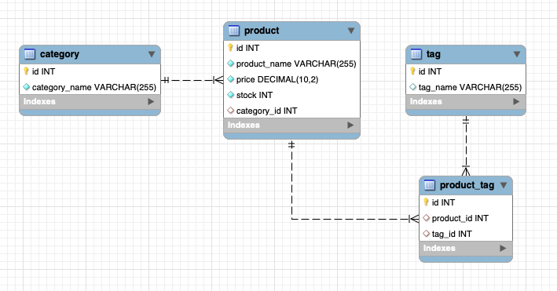
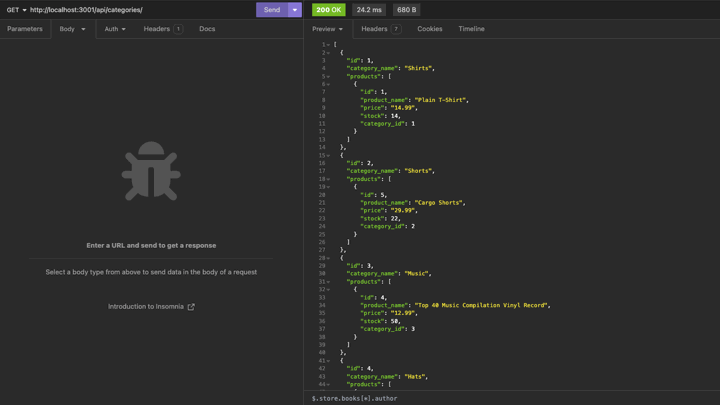
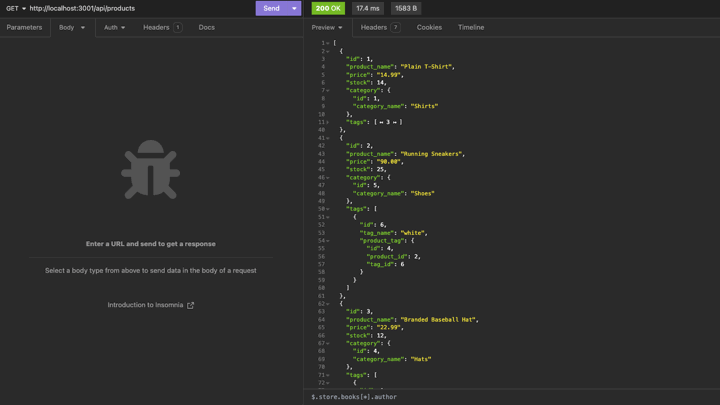
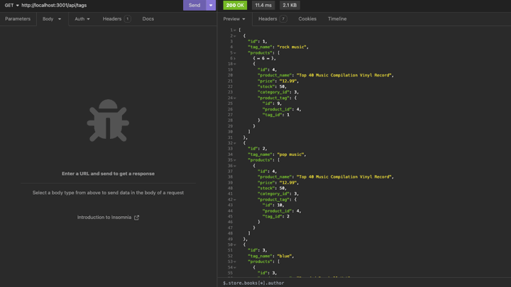

# ORM E-Commerce Back End

## Description 
The goal of this project is to build the back end functionality of an e-commerce website using [Express.js](https://www.npmjs.com/package/express) API and [Sequelize](https://sequelize.org/docs/v6/) to interact with the MySQL database. 

Sequelize is a Node.js-based Object Relational Mapper (ORM) that simplifies relational database managment by representing database data as objects, and vice versa. This creates a middelware bridge between MySQL and object-oriented programs to allow programmers to efficiently build powerful and manageable tools.

This project defines 4 Sequelize models: 
1. `Category` 
2. `Product`
3. `Tag`
4. `ProductTag`

The database is mapped according to the following schema:  

## Table of Contents 
- [Walkthough Video](#walkthrough-video)
- [Installation](#installation)
- [Dependencies](#dependencies)
- [Usage](#usage)
- [Testing](#testing)
- [Contributing](#contributing)
- [License](#license)
- [Questions](#questions)

## Walkthrough Video

Click the following link to view a walkthrough video on the usage of the application: [Walkthrough Video: ORM Ecommerce]()  
  
## Installation 

### Getting Started 
1. Clone this repository to your local machine. (For reference, visit the [Cloning a Repository](https://docs.github.com/en/repositories/creating-and-managing-repositories/cloning-a-repository) GitHub Docs article.)
2. Create a `.env` file to store your MySQL credentials and database name.
3. Run `npm install` in your CLI to download the npm package dependencies. 

### Create the MySQL database 
4. Run `mysql -uroot -p` in your CLI and log into MySQL.
5. Run `source db/schema.sql` to create the database on your local machine.
6. Exit out of MySQL by running `exit`.

### Seed the Database and Start the Server 
7. Run `npm run seed` in the root directory to seed the database.
8. Run `npm run start` to sync the Sequelize models to the MySQL database and start the server.
  
## Dependencies
This project requires the following npm package dependencies:
1. [Dotenv](https://www.npmjs.com/package/dotenv)
2. [Express](https://www.npmjs.com/package/express)
3. [MySQL2](https://www.npmjs.com/package/mysql2)
4. [Sequelize](https://www.npmjs.com/package/sequelize)
  
## Usage 

### Category API Routes
The animation gif below shows the request responses for `Category` API routes. 
  

- `GET /` will return all categories in the database
- `GET /:id` will return the `Category` with `id`, including its associated `Product` data
- `POST /` will create a `Category` instance with the provided `category_name` in the req.body
- `PUT /:id` will update the `Category` with `id` using the information in req.body
- `DELETE /:id` will delete the `Category` from the database 

### Product API Routes
The animation gif below shows the request responses for `Product` API routes. 
  

- `GET /` will return all products in the database
- `GET /:id` will return the `Product` with `id`, including its associated `Category` and `Tag` data
- `POST /` will create a `Product` instance with the provided `product_name`, `price`, `stock`, `category_id`, and `tagIds` in the req.body
- `PUT /:id` will update the `Product` with `id` using the information in req.body
- `DELETE /:id` will delete the `Product` from the database 

### Tag API Routes
The animation gif below shows the request responses for `Tag` API routes. 
  

- `GET /` will return all tags in the database
- `GET /:id` will return the `Tag` with `id`, including its associated `Product` data 
- `POST /` will create a `Tag` instance with the provided `tag_name` and `product_ids` in the req.body
- `PUT /:id` will update the `Tag` with `id` using the information in req.body
- `DELETE /:id` will delete the `Tag` from the database 

## Testing 
No test suites have been written for this application. The API routes were tested locally during development with the [Insomnia](https://docs.insomnia.rest/) development platform.  
Please refer to the [Installation](#installation) section if you are interested in running and testing the application locally.

## Contributing
To make contributions to this project:  
1. Fork the repository  
2. Make some commits to improve the application
3. Open a Pull Request on GitHub
4. From there, we can discuss your changes and merge the pull request once your contributions have been approved!

## License 
This GitHub repository is licensed under the MIT license. Please refer to the license documentation [here](https://opensource.org/licenses/MIT).
  
## Questions
This project was developed by [dymoy](https://github.com/dymoy).  
For any related questions, please contact me via email at <derekymoy@gmail.com>.